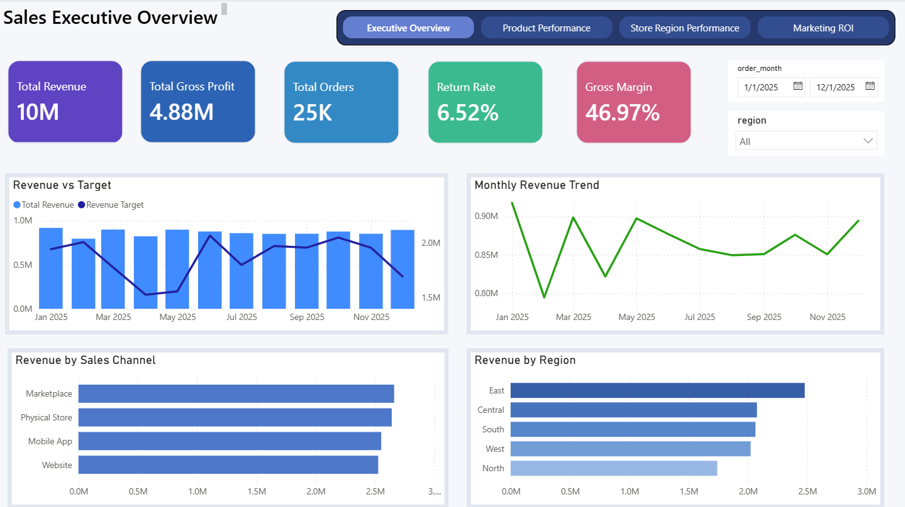
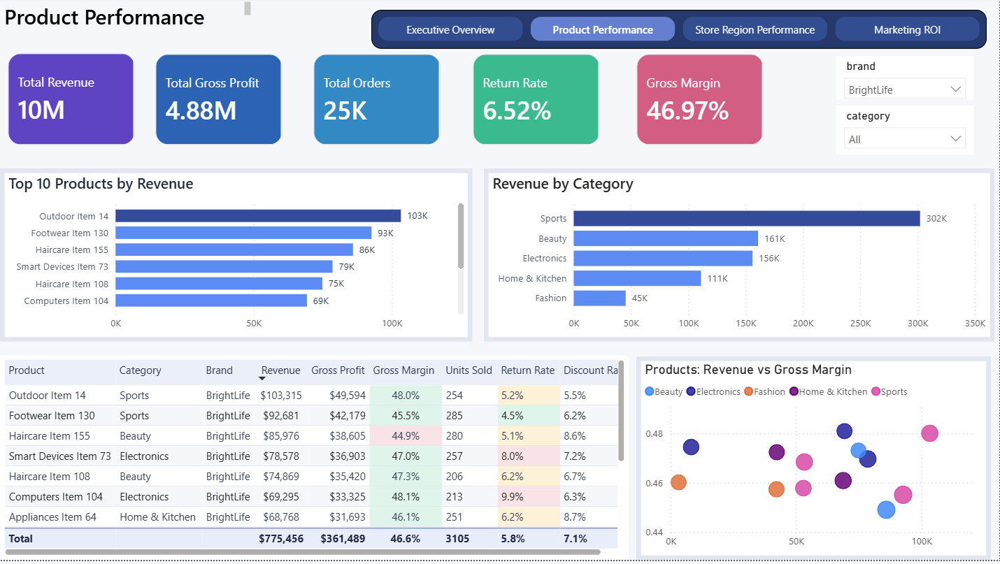
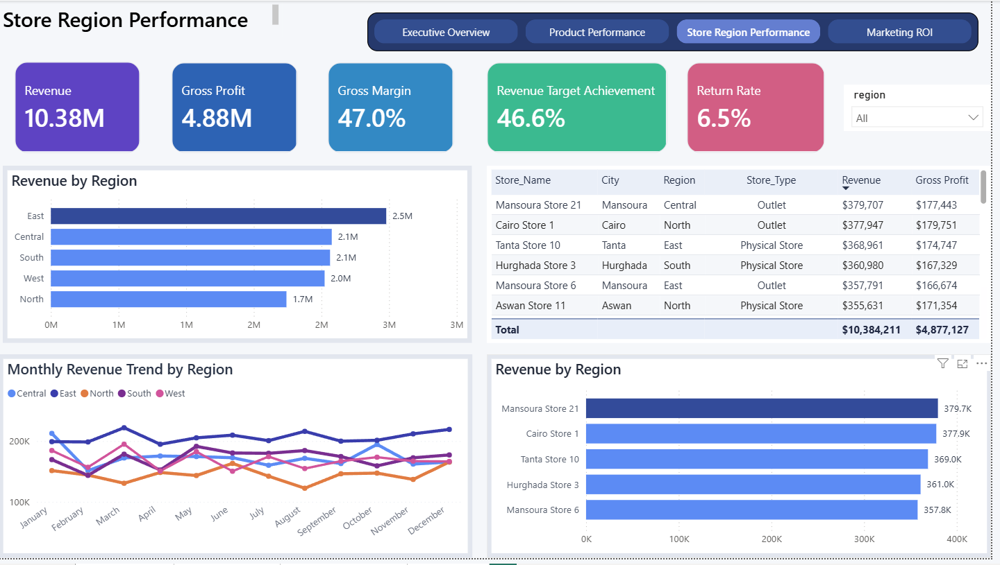
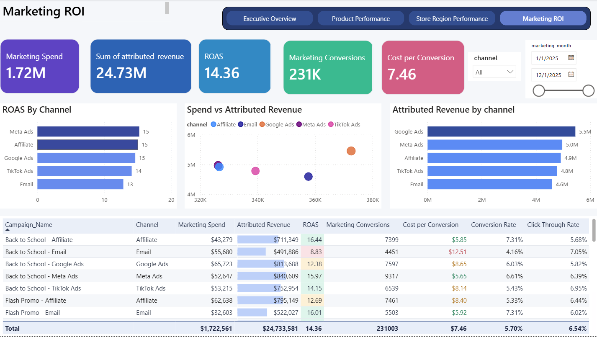

# Retail Revenue Intelligence Dashboard

## Project Overview

This project is an end-to-end Business Intelligence solution for a fictional retail and e-commerce company. The company sells products through multiple physical stores and online channels, but its reporting process depends on manually prepared spreadsheets from different business areas.

The goal of this project is to transform messy sales, returns, product, store, customer, marketing, and target data into a clean analytical model and an executive Power BI dashboard.

The dashboard helps business users monitor revenue, profitability, returns, regional performance, product performance, and marketing ROI in one place.

## Business Problem

The company faces several reporting and analytics challenges:

* Sales, returns, product, store, customer, marketing, and target data are stored in separate files.
* Reports are prepared manually, which is time-consuming and error-prone.
* KPI definitions are inconsistent across teams.
* Management does not have one trusted view of revenue, profit, margin, returns, and target achievement.
* High-revenue products are not always the most profitable products.
* Some stores and regions may appear successful by revenue but underperform by profit or return rate.
* Marketing channels are often evaluated by revenue only, without considering return on ad spend or cost per conversion.

## Project Objective

The objective is to build a lightweight BI solution that:

* Cleans and standardizes raw CSV data.
* Combines multiple business data sources into a consistent analytical model.
* Defines clear KPI calculations.
* Builds dashboard pages for executive, product, store, and marketing analysis.
* Highlights business issues such as low-margin products, high-return products, underperforming stores, and inefficient marketing campaigns.
* Provides business insights and recommendations based on the analysis.

## Target Users

The dashboard is designed for:

* Executive management
* Sales and operations managers
* Product managers
* Marketing managers

## Key Business Questions

This project answers questions such as:

* What is the total revenue, gross profit, and gross margin?
* Are monthly revenue and profit targets being achieved?
* Which products and categories generate the most revenue and profit?
* Which products have high return rates?
* Which stores or regions are underperforming?
* Which sales channels are most profitable?
* Which marketing channels have the best return on ad spend?
* Which campaigns have high spend but low conversion?

## Dataset

The project uses a synthetic retail dataset generated for portfolio and learning purposes. The dataset is intentionally designed to include realistic business issues such as duplicate records, missing values, inconsistent naming, returns, discounts, and target gaps.

The dataset contains the following files:

| File                  | Description                                                 |
| --------------------- | ----------------------------------------------------------- |
| `orders.csv`          | Sales transactions across stores and online channels        |
| `returns.csv`         | Returned orders and refund information                      |
| `products.csv`        | Product master data including categories and cost           |
| `stores.csv`          | Store and region information                                |
| `customers.csv`       | Customer information and segments                           |
| `marketing_spend.csv` | Campaign spend, clicks, conversions, and attributed revenue |
| `targets.csv`         | Monthly revenue and profit targets by region                |

## Tools Used

| Layer                           | Tool             |
| ------------------------------- | ---------------- |
| Data generation                 | Python           |
| Data storage and transformation | DuckDB / SQL     |
| Dashboarding                    | Power BI Desktop |
| Version control                 | GitHub           |

## Dashboard Pages

The Power BI dashboard contains four main pages:

### 1. Executive Overview



### 2. Product Performance



### 3. Store and Region Performance



### 4. Marketing ROI




## Key KPIs

The main KPIs include:

| KPI                          | Description                                                          |
| ---------------------------- | -------------------------------------------------------------------- |
| Revenue                      | Sales amount after discounts                                         |
| Gross Profit                 | Revenue minus product cost                                           |
| Gross Margin %               | Gross profit divided by revenue                                      |
| Total Orders                 | Number of unique orders                                              |
| Units Sold                   | Total quantity sold                                                  |
| Average Order Value          | Revenue divided by total orders                                      |
| Return Rate %                | Returned orders or products divided by total orders or products sold |
| Revenue Target Achievement % | Actual revenue divided by revenue target                             |
| Profit Target Achievement %  | Actual profit divided by profit target                               |
| Marketing Spend              | Total amount spent on campaigns                                      |
| Attributed Revenue           | Revenue linked to marketing activity                                 |
| ROAS                         | Attributed revenue divided by marketing spend                        |
| Cost per Conversion          | Marketing spend divided by conversions                               |
| Conversion Rate              | Conversions divided by clicks                                        |

## Repository Structure

```text
retail-revenue-intelligence-dashboard/
│
├── data/
│   ├── raw/
│   ├── cleaned/
│   └── output/
│
├── python/
│   └── generate_sample_data.py
│
├── sql/
│   ├── 01_create_raw_tables.sql
│   ├── 02_clean_orders.sql
│   ├── 03_clean_dimensions.sql
│   ├── 04_build_fact_sales.sql
│   └── 05_build_kpi_views.sql
│
├── dashboard/
│   ├── retail_revenue_dashboard.pbix
│   └── screenshots/
│
├── docs/
│   ├── business_problem.md
│   ├── data_dictionary.md
│   ├── kpi_dictionary.md
│   ├── data_model.md
│   └── insights.md
│
├── README.md
└── requirements.txt
```

## Project Workflow

The project follows these steps:

1. Define the business problem and reporting requirements.
2. Generate a realistic synthetic retail dataset.
3. Load the raw CSV files into DuckDB.
4. Clean and standardize the raw data using SQL.
5. Build analytical fact and dimension tables.
6. Create KPI views for dashboard consumption.
7. Build a Power BI dashboard.
8. Document the data model, KPIs, and business insights.
9. Publish the project on GitHub as a portfolio case study.

## Expected Business Insights

The project is designed to identify insights such as:

* Revenue growth does not always mean profit growth.
* Some high-revenue products may have weak margins due to discounts or high return rates.
* Some regions may meet revenue targets while missing profit targets.
* Certain stores may have operational issues reflected in high return rates.
* Marketing channels with the highest revenue may not have the best return on ad spend.
* Campaigns with high spend and low conversion should be reviewed.

## Project Status

Planned phases:

* Phase 1: Business requirements
* Phase 2: Dataset design and generation
* Phase 3: SQL cleaning and transformation
* Phase 4: KPI dictionary and data model documentation
* Phase 5: Power BI dashboard development
* Phase 6: Business insights and recommendations

## Future Improvements

Possible future improvements include:

* Adding customer lifetime value analysis.
* Adding cohort analysis.
* Adding demand forecasting.
* Adding anomaly detection for unusual sales or return patterns.
* Building a Tableau version of the dashboard.
* Deploying the data pipeline using cloud tools.
* Adding an AI-powered natural language analytics assistant.

## Disclaimer

This project uses synthetic data created for learning and portfolio purposes. It does not contain real company, customer, or transaction data.
